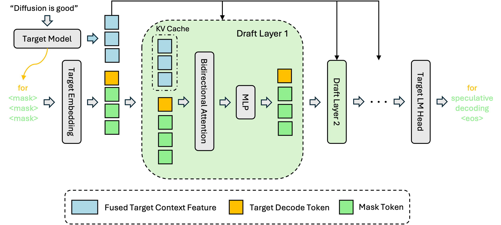

# DFlash: Block Diffusion for Flash Speculative Decoding
[**Paper (Coming Soon)**](#) | [**Blog**](https://z-lab.ai/projects/dflash/)

**DFlash** is a lightweight **block diffusion** model designed for speculative decoding. It enables efficient and high-quality parallel drafting.
<br>

<div align="center">
  <span style="display: inline-block; background-color: #ffffff; padding: 10px; border-radius: 10px;">
    
  </span>
</div>

<br>

## 🚀 Quick Start

### Installation
```bash
conda create -n dflash python=3.11
conda activate dflash

git clone https://github.com/z-lab/dflash.git
cd dflash

pip install -r requirements.txt
pip install flash-attn --no-build-isolation
```

### Example Usage
The following example demonstrates how to load the DFlash drafter and the Qwen3-8B target model to perform speculative decoding.
```python
import torch
from transformers import AutoModel, AutoModelForCausalLM, AutoTokenizer

# 1. Load the DFlash Draft Model
# Note: trust_remote_code=True is required for the custom diffusion architecture. We recommend run on one GPU currently.
model = AutoModel.from_pretrained(
    "z-lab/Qwen3-8B-DFlash-b16", 
    trust_remote_code=True, 
    dtype="auto", 
    device_map="cuda:0"
).eval()

# 2. Load the Target Model
target = AutoModelForCausalLM.from_pretrained(
    "Qwen/Qwen3-8B", 
    dtype="auto", 
    device_map="cuda:0"
).eval()

# 3. Load Tokenizer
tokenizer = AutoTokenizer.from_pretrained("Qwen/Qwen3-8B")
# Essential: Add the mask token required for diffusion steps
tokenizer.add_special_tokens({"mask_token": "<|MASK|>"})

# 4. Prepare Input
prompt = "How many positive whole-number divisors does 196 have?"
messages = [
    {"role": "user", "content": prompt}
]
# Note: this draft model is used for thinking mode disabled
text = tokenizer.apply_chat_template(
    messages,
    tokenize=False,
    add_generation_prompt=True,
    enable_thinking=False
)
model_inputs = tokenizer([text], return_tensors="pt").to(model.device)

# 5. Run Speculative Decoding
# The 'spec_generate' function is a custom method provided by the DFlash model
generate_ids = model.spec_generate(
    input_ids=model_inputs["input_ids"], 
    max_new_tokens=2048, 
    temperature=0.0, 
    target=target, 
    mask_token_id=tokenizer.mask_token_id, 
    stop_token_ids=[tokenizer.eos_token_id]
)

print(tokenizer.decode(generate_ids[0], skip_special_tokens=True))
```

## 📊 Evaluation & Benchmarks
We provide scripts to reproduce our speedup and acceptance length metrics. The reported results were tested on NVIDIA B200 GPUs.

To run the benchmark:
```bash
bash run_benchmark.sh
```

#### **Math Benchmarks**

| Method | Temp | GSM8K<br /><sub>Speedup / $\tau$</sub> | Math500<br /><sub>Speedup / $\tau$</sub> | AIME24<br /><sub>Speedup / $\tau$</sub> | AIME25<br /><sub>Speedup / $\tau$</sub> | Average<br /><sub>Speedup / $\tau$</sub> |
| :--- | :---: | :---: | :---: | :---: | :---: | :---: |
| Qwen3-8B-speculator.eagle3| 0 | 2.13x / 2.89 | 2.18x / 2.94 | 2.25x / 3.04 | 2.18x / 2.93 | 2.19x / 2.95 |
| **Qwen3-4B-DFlash-b16**| 0 | **5.17x / 6.50** | **6.19x / 7.84** | **6.00x / 7.47** | **5.79x / 7.28** | **5.79x / 7.27** |
| **Qwen3-8B-DFlash-b16**| 0 | **5.20x / 6.55** | **6.17x / 7.87** | **5.91x / 7.48** | **5.85x / 7.31** | **5.78x / 7.30** |
| Qwen3-8B-speculator.eagle3| 1 | 2.07x / 2.79 | 2.03x / 2.75 | 1.88x / 2.54 | 1.81x / 2.44 | 1.95x / 2.63 |
| **Qwen3-4B-DFlash-b16**| 1 | **4.73x / 5.98** | **5.14x / 6.67** | **3.84x / 4.97** | **3.89x / 5.01** | **4.40x / 5.66** |
| **Qwen3-8B-DFlash-b16**| 1 | **4.78x / 6.04** | **5.02x / 6.57** | **3.87x / 5.06** | **3.84x / 5.03** | **4.38x / 5.68** |

#### **Code Benchmarks**

| Method | Temp | Humaneval<br /><sub>Speedup / $\tau$</sub> | MBPP<br /><sub>Speedup / $\tau$</sub> | LiveCodeBench<br /><sub>Speedup / $\tau$</sub> | SWE-Bench<br /><sub>Speedup / $\tau$</sub> | Average<br /><sub>Speedup / $\tau$</sub> |
| :--- | :---: | :---: | :---: | :---: | :---: | :---: |
| Qwen3-8B-speculator.eagle3| 0 | 2.48x / 3.36 | 2.27x / 3.08 | 2.24x / 3.16 | 1.90x / 2.55 | 2.22x / 3.04 |
| **Qwen3-4B-DFlash-b16**| 0 | **5.26x / 6.63** | **4.87x / 6.19** | **5.41x / 6.97** | **2.97x / 3.70** | **4.63x / 5.87** |
| **Qwen3-8B-DFlash-b16**| 0 | **5.20x / 6.55** | **4.75x / 6.00** | **5.43x / 7.12** | **2.92x / 3.69** | **4.58x / 5.84** |
| Qwen3-8B-speculator.eagle3| 1 | 2.30x / 3.11 | 2.15x / 2.92 | 2.17x / 3.00 | 1.66x / 2.21 | 2.07x / 2.81 |
| **Qwen3-4B-DFlash-b16**| 1 | **4.80x / 6.05** | **4.35x / 5.55** | **5.00x / 6.60** | **2.51x / 3.09** | **4.17x / 5.32** |
| **Qwen3-8B-DFlash-b16**| 1 | **4.35x / 5.40** | **4.07x / 5.17** | **5.15x / 6.79** | **2.30x / 2.82** | **3.97x / 5.05** |

#### **Chat Benchmarks**

| Method | Temp | MT-Bench<br /><sub>Speedup / $\tau$</sub> | Alpaca<br /><sub>Speedup / $\tau$</sub> | Average<br /><sub>Speedup / $\tau$</sub> |
| :--- | :---: | :---: | :---: | :---: |
| Qwen3-8B-speculator.eagle3| 0 | 1.94x / 2.72 | 1.88x / 2.68 | 1.91x / 2.70 |
| **Qwen3-4B-DFlash-b16**| 0 | **2.87x / 4.35** | **2.23x / 3.10** | **2.55x / 3.73** |
| **Qwen3-8B-DFlash-b16** | 0 | **2.79x / 4.25** | **2.27x / 3.16** | **2.53x / 3.71** |
| Qwen3-8B-speculator.eagle3| 1 | 1.81x / 2.55 | 1.79x / 2.56 | 1.80x / 2.56 |
| **Qwen3-4B-DFlash-b16** | 1 | **2.63x / 4.03** | **2.16x / 2.99** | **2.40x / 3.51** |
| **Qwen3-8B-DFlash-b16**| 1 | **2.50x / 3.74** | **2.11x / 2.88** | **2.31x / 3.31** |

## Citation
If you find DFlash useful for your research or applications, please cite our project. The paper is coming soon.
@misc{dflash2025,
    title={DFlash: Block Diffusion for Flash Speculative Decoding},
    author={Your Name and Co-authors},
    year={2025},
    howpublished={\url{https://your-blog-url.com}},
    note={Accessed: 2025-01-04}
}